# E-D3DGS monocular-COLMAP + per-Gaussian embedding + synthetic stereo pipeline

This document maps the current repository as an end-to-end pipeline. It is written for the actual project setup: **a monocular video is converted with COLMAP/SfM into camera poses and a sparse point cloud**, then E-D3DGS learns a deformable 3D Gaussian scene. Dynamic-mask-specific branches are intentionally omitted.

> The main diagram uses **method-level blocks**, not source-file blocks. Code/file names are kept later only as a repository reference map.

---

## 1. Full wireframe

```mermaid
flowchart LR
  subgraph INPUT[Input]
    direction TB
    I0["Monocular RGB video<br/>I^{t-1}, I^t, I^{t+1}, ..."]
  end

  subgraph PRE[Preprocessing / priors]
    direction TB
    P0["Monocular SfM / COLMAP<br/>recover camera trajectory + sparse geometry"]
    P1["Camera calibration and trajectory<br/>K, R_t, T_t, FoV, timestamp t"]
    P2["Initial sparse 3D points<br/>X_0 with RGB colours"]
    P3["Motion-prior estimation<br/>optical flow - camera/parallax flow"]
    P4["Optional monocular depth prior<br/>relative depth per frame"]
  end

  subgraph SCENE[Scene representation]
    direction TB
    S0["Viewpoint sequence<br/>per-frame camera C_t"]
    S1["Initial Gaussian cloud<br/>centres and colours from SfM points"]
    S2["Sidecar priors attached to frames<br/>motion confidence M_t, optional depth Z_t"]
  end

  subgraph MODEL[Per-Gaussian embedded dynamic 3DGS]
    direction TB
    M0["Trainable Gaussian state θ_i<br/>x_i, scale_i, rotation_i, opacity_i, SH colour_i"]
    M1["Learned per-Gaussian identity embedding<br/>e_i"]
    M2["Temporal embedding<br/>τ(t)"]
    C0(("C"))
    M3["Concatenated deformation feature<br/>h_i(t) = [τ(t), e_i]"]
    M4["Coarse + fine deformation MLPs<br/>Δx, Δscale, Δrot, Δopacity, ΔSH"]
    M5["Deformed Gaussian state<br/>θ_i(t)"]
  end

  subgraph RENDER[Rendering and supervision]
    direction TB
    R0["Differentiable Gaussian splatting<br/>input/left camera C_t"]
    R1["Rendered input view<br/>Î_L, depth D_L, visibility/radii"]
    R2["Synthetic right camera<br/>C_R = C_L + baseline · right_axis"]
    R3["Rendered synthetic right view<br/>Î_R"]
    L0["Photometric + SSIM supervision<br/>Î_L vs monocular GT I_t"]
    L1["Stereo consistency<br/>warp Î_L,D_L into synthetic right view and compare to Î_R"]
    L2["Motion-prior supervision<br/>weight errors using residual motion confidence M_t"]
    L3["Regularisation<br/>embedding smoothness, temporal TV, opacity, optional depth"]
  end

  subgraph OPT[Optimisation]
    direction TB
    O0["Backpropagation<br/>gradients to Gaussians, embeddings, deformation MLP"]
    O1["Densify / prune<br/>split, clone, remove low-opacity or unhelpful Gaussians"]
    O2["Trained dynamic Gaussian scene"]
  end

  subgraph OUT[Outputs]
    direction TB
    F0["Monocular render output<br/>train/test/video trajectory"]
    F1["Synthetic stereo output<br/>left=input-view render, right=baseline-shift render"]
    F2["Quality evaluation<br/>PSNR, SSIM, LPIPS, temporal/stereo proxy metrics"]
  end

  I0 --> P0
  I0 --> P3
  I0 --> P4
  P0 --> P1
  P0 --> P2
  P1 --> S0
  P2 --> S1
  P3 --> S2
  P4 --> S2
  S0 --> R0
  S1 --> M0
  S2 --> L2
  M0 --> M1
  M1 --> C0
  M2 --> C0
  C0 --> M3 --> M4 --> M5 --> R0
  R0 --> R1
  R1 --> R2 --> R3
  R1 --> L0
  R1 --> L1
  R3 --> L1
  L0 --> O0
  L1 --> O0
  L2 --> O0
  L3 --> O0
  O0 --> O1 --> M0
  O1 --> O2
  O2 --> F0
  O2 --> F1
  F0 --> F2
  F1 --> F2

  classDef input fill:#e8f5e9,stroke:#355f22,stroke-width:2px,color:#111;
  classDef prep fill:#fff7ed,stroke:#9a3412,stroke-width:2px,color:#111;
  classDef scene fill:#f8fafc,stroke:#334155,stroke-width:2px,color:#111;
  classDef model fill:#eef2ff,stroke:#1d4ed8,stroke-width:2px,color:#111;
  classDef render fill:#e0f2fe,stroke:#075985,stroke-width:2px,color:#111;
  classDef opt fill:#f1f5f9,stroke:#334155,stroke-width:2px,color:#111;
  classDef out fill:#f3e8ff,stroke:#6b21a8,stroke-width:2px,color:#111;
  class I0 input;
  class P0,P1,P2,P3,P4 prep;
  class S0,S1,S2 scene;
  class M0,M1,M2,M3,M4,M5,C0 model;
  class R0,R1,R2,R3,L0,L1,L2,L3 render;
  class O0,O1,O2 opt;
  class F0,F1,F2 out;
```



---

## 2. Repository map

### Root-level entry points

| File | Role in the pipeline |
|---|---|
| `train.py` | Main training entry point. Builds `Scene`, initializes/loads `GaussianModel`, samples frames, renders, computes losses, backpropagates, densifies/prunes, saves checkpoints. Includes synthetic stereo consistency and motion-prior supervision. |
| `render.py` | Monocular rendering of train/test/video cameras from a trained checkpoint. |
| `render_stereo.py` | Synthetic stereo rendering. Uses the monocular/input camera as the left view and creates a right view by horizontal baseline/IPD shift. Encodes stereo videos. |
| `metrics.py` | Evaluation: PSNR, SSIM, LPIPS, temporal flicker score, proxy optical-flow EPE, proxy D1-all stereo metric, and optional MUSIQ/IQ. |
| `convert.py` | COLMAP conversion utility inherited from 3DGS-style workflows. |
| `external.py`, `helpers.py` | Utility functions from original Gaussian Splatting code: losses, KNN, quaternions, optimizer parameter helpers, densification helpers. |
| `README.md`, `LICENSE.md`, `requirements.txt` | Upstream project docs, license, Python dependencies. |

### Configuration system

| Path | Purpose |
|---|---|
| `arguments/__init__.py` | Defines `ModelParams`, `PipelineParams`, `OptimizationParams`, and `ModelHiddenParams`. |
| `arguments/dynerf/*.py` | Dataset/scene configs for dynerf-style scenes. |
| `arguments/technicolor/*.py` | Dataset/scene configs for Technicolor-style scenes. |
| `arguments/hypernerf/*.py` | Dataset/scene configs for HyperNeRF/Nerfies-style scenes. |
| `utils/params_utils.py` | Merges config-file hyperparameters with CLI overrides. |

Important arguments used in this diagram:

- `ModelParams`: `source_path`, `model_path`, `images`, `loader`, `use_motion_priors`, `motion_prior_dir`, `use_depth_maps`, `depth_dir`.
- `ModelHiddenParams`: `temporal_embedding_dim`, `gaussian_embedding_dim`, `min_embeddings`, `max_embeddings`, `defor_depth`, `net_width`, `use_coarse_temporal_embedding`, `c2f_temporal_iter`, `deform_from_iter`.
- `OptimizationParams`: learning rates, densification/pruning schedule, `motion_prior_loss_weight`, `motion_prior_frame_sample_prob`, `use_motion_prior_densification`, `lambda_stereo_consistency`, `stereo_baseline`, `stereo_occlusion_tolerance`.

### Scene and data loading

| Path | Role |
|---|---|
| `scene/dataset_readers.py` | Reads COLMAP extrinsics/intrinsics and point clouds. Resolves `ns_output/colmap/sparse/0`, `colmap/dense/workspace/sparse`, images, optional motion-prior/depth sidecars. Produces `SceneInfo`. |
| `scene/colmap_loader.py` | Binary/text COLMAP model readers: cameras, images, and `points3D`. |
| `scene/__init__.py` | `Scene` object. Calls dataset reader, writes `input.ply` and `cameras.json`, constructs train/test/video camera lists, initializes/loads Gaussian model. |
| `scene/cameras.py` | `Camera` module. Stores COLMAP pose, projection matrix, image path/tensor, timestamp, camera id, frame id, optional motion prior, optional depth map. Builds `world_view_transform`, `projection_matrix`, `full_proj_transform`, `camera_center`. |
| `utils/camera_utils.py` | Converts `CameraInfo` into `Camera` objects; resolves sidecar paths for motion prior and depth maps. |
| `utils/graphics_utils.py` | Projection matrices, world-to-view transforms, FoV/focal conversion, point transforms, quaternion helpers. |

### Model and renderer

| Path | Role |
|---|---|
| `scene/gaussian_model.py` | Owns trainable Gaussian state: `_xyz`, `_features_dc`, `_features_rest`, `_scaling`, `_rotation`, `_opacity`, `_embedding`, deformation network, optimizer, checkpoint I/O, densification/pruning. |
| `scene/deformation.py` | E-D3DGS deformation network. Uses temporal embeddings and learned per-Gaussian embeddings, with coarse and fine MLP stages. |
| `gaussian_renderer/__init__.py` | Applies deformation, clamps invalid values, converts raw scale/rotation/opacity, and calls the differentiable CUDA rasterizer. Returns image, depth, radii, visibility, and final deformed parameters. |
| `submodules/diff-gaussian-rasterization/` | CUDA differentiable Gaussian rasterizer. |
| `submodules/simple-knn/` | CUDA KNN used for initialization/densification scale estimates. |

### Training utilities

| Path | Role |
|---|---|
| `utils/loss_utils.py` | L1, L2, SSIM, LPIPS wrappers. |
| `utils/image_utils.py` | MSE and PSNR. |
| `utils/extra_utils.py` | KNN, weighted L2, image sampler, camera-distance sampling. |
| `utils/general_utils.py` | Inverse sigmoid, LR schedules, covariance helpers, random-state setup. |
| `utils/scene_utils.py` | Intermediate training render logging and point-cloud visualization. |
| `utils/timer.py` | Timing helper. |
| `utils/pose_utils.py` | Camera-pose interpolation helpers. |
| `utils/sh_utils.py` | Spherical harmonics utilities. |
| `utils/system_utils.py` | Filesystem helpers and max-iteration search. |

### Preprocessing scripts included in the mapped pipeline

| Path | Role |
|---|---|
| `script/pre_n3v.py` | Preprocess Neural 3D Video style data into COLMAP-compatible layout. |
| `script/pre_technicolor.py` | Preprocess Technicolor style data. |
| `script/pre_hypernerf.py` | Preprocess HyperNeRF/Nerfies style data. |
| `script/downsample_point.py` | Downsamples COLMAP/dense point cloud. |
| `script/generate_motion_priors.py` | Generates camera-compensated residual motion priors from monocular frame sequences. |
| `script/generate_da3_depth_maps.py` | Generates Depth Anything V3 monocular depth sidecars. |
| `script/thirdparty/*` | COLMAP database and preprocessing helpers. |
| `script/colmap_setup.sh` | COLMAP environment installation helper. |

### Omitted from the diagram by request

The repository contains dynamic-mask generation and dynamic-mask training code, but those branches are not included in this document. Files such as `script/generate_dynamic_masks.py`, mask post-processing wrappers, mask-guided seed-point branches, and mask-weighted loss branches are therefore deliberately not expanded here.

---

## 3. End-to-end data flow

### 3.1 Monocular frames → COLMAP scene

The project starts with a monocular video or extracted image sequence:

```text
images/frame_0000.png, images/frame_0001.png, ...
```

COLMAP/SfM estimates:

```text
cameras.bin/txt   → intrinsics K or FoV parameters
images.bin/txt    → per-frame camera pose R,T
points3D.bin/txt  → sparse 3D point cloud
```

`scene/dataset_readers.py` resolves several possible COLMAP locations:

```text
colmap/dense/workspace/sparse
ns_output/colmap/sparse/0
ns_output/colmap/sparse_work/0
ns_output/colmap/sparse
```

It then resolves or creates the point cloud:

```text
points3D_downsample.ply
points3D.ply
sparse/points3D.ply
fused.ply
points3D.bin/txt → storePly(points3D_downsample.ply)
```

### 3.2 Scene assembly

`Scene(dataset, gaussians, ...)` performs:

1. Load `SceneInfo` through the selected loader: `Dynerf`, `Technicolor`, or `Nerfies`.
2. Build train/test/video `Camera` objects.
3. Save `input.ply` and `cameras.json` into the output directory.
4. Initialize `GaussianModel` from the COLMAP point cloud if no checkpoint is loaded.
5. Otherwise load `point_cloud.ply` and `deformation.pth` from a checkpoint.

Each `Camera` stores:

```text
R, T, FoVx, FoVy, timestamp/time, cam_no, frame_no,
image path/tensor, motion_prior sidecar, optional depth sidecar,
world_view_transform, projection_matrix, full_proj_transform, camera_center
```

---

## 4. Mathematical model

### 4.1 Camera model

A world point in homogeneous coordinates is

\[
\tilde{X}_w = [x,y,z,1]^\top.
\]

The camera transform is represented by COLMAP-derived rotation and translation:

\[
X_c = R X_w + T.
\]

In homogeneous form, the renderer uses a world-view matrix \(W\) and projection matrix \(P\):

\[
\tilde{X}_{clip} = P W \tilde{X}_w.
\]

Normalized device coordinates are

\[
(x_{ndc}, y_{ndc}) = \left(\frac{X_{clip}}{W_{clip}}, \frac{Y_{clip}}{W_{clip}}\right).
\]

FoV and focal length are related by

\[
f_x = \frac{W_{img}}{2\tan(\mathrm{FoV}_x/2)},
\qquad
f_y = \frac{H_{img}}{2\tan(\mathrm{FoV}_y/2)}.
\]

### 4.2 Gaussian state

Each 3D Gaussian \(i\) stores trainable parameters:

\[
\Theta_i = \{\mu_i, s_i, q_i, \alpha_i, c_i, e_i\}
\]

where:

- \(\mu_i \in \mathbb{R}^3\): Gaussian center, implemented by `_xyz`.
- \(s_i \in \mathbb{R}^3\): log scale, implemented by `_scaling`.
- \(q_i \in \mathbb{R}^4\): quaternion rotation, implemented by `_rotation`.
- \(\alpha_i \in \mathbb{R}\): opacity logit, implemented by `_opacity`.
- \(c_i\): spherical-harmonics color coefficients, implemented by `_features_dc` and `_features_rest`.
- \(e_i \in \mathbb{R}^{d_g}\): learned **per-Gaussian embedding**, implemented by `_embedding`.

The covariance is built from scale and rotation:

\[
S_i = \operatorname{diag}(\exp(s_i)),
\qquad
R_i = R(q_i),
\qquad
\Sigma_i = R_i S_i S_i^\top R_i^\top.
\]

Opacity is activated with sigmoid:

\[
\hat{\alpha}_i = \sigma(\alpha_i).
\]

### 4.3 E-D3DGS per-Gaussian embedded deformation

At time \(t\), `deform_network` obtains a temporal embedding

\[
\tau(t) \in \mathbb{R}^{d_t}
\]

from a learned temporal grid. The temporal resolution grows coarse-to-fine during training:

\[
N_{emb}(k) = N_{min} + (N_{max}-N_{min})\frac{\min(k,K_{c2f})}{K_{c2f}},
\]

where \(k\) is iteration and \(K_{c2f}\) is `c2f_temporal_iter`.

For each Gaussian, E-D3DGS concatenates temporal and Gaussian identity information:

\[
h_i(t) = [\tau(t), e_i].
\]

The coarse MLP predicts an intermediate deformation:

\[
(\Delta\mu_i^c, \Delta s_i^c, \Delta q_i^c, \Delta\alpha_i^c, \Delta c_i^c)
= f_c(h_i(t)).
\]

The fine MLP refines the result:

\[
(\Delta\mu_i^f, \Delta s_i^f, \Delta q_i^f, \Delta\alpha_i^f, \Delta c_i^f)
= f_f(h_i(t)).
\]

The deformed Gaussian parameters are then approximately:

\[
\mu_i(t)=\mu_i+\Delta\mu_i,
\quad
s_i(t)=s_i+\Delta s_i,
\quad
q_i(t)=q_i+\Delta q_i,
\quad
\alpha_i(t)=\alpha_i+\Delta\alpha_i,
\quad
c_i(t)=c_i+\Delta c_i.
\]

In code, this happens in:

```text
scene/deformation.py::deform_network.forward
scene/deformation.py::query_time
scene/deformation.py::deform
```

### 4.4 Differentiable Gaussian rasterization

For each camera, `gaussian_renderer.render()`:

1. Builds rasterization settings from the camera matrices.
2. Calls the deformation network at the camera timestamp.
3. Converts raw scale/rotation/opacity to valid values.
4. Rasterizes deformed 3D Gaussians into an image.

A projected Gaussian contributes to a pixel \(p\) using an elliptical 2D Gaussian weight:

\[
w_i(p) = \exp\left(-\frac{1}{2}(p - \pi(\mu_i))^\top \Sigma_{i,2D}^{-1}(p - \pi(\mu_i))\right),
\]

where \(\pi(\cdot)\) is the camera projection and \(\Sigma_{i,2D}\) is the projected covariance.

Alpha compositing is front-to-back:

\[
C(p) = \sum_i T_i(p)\, a_i(p)\, c_i(p),
\]

with

\[
a_i(p) = \hat{\alpha}_i w_i(p),
\qquad
T_i(p)=\prod_{j<i}(1-a_j(p)).
\]

The renderer returns:

```text
rendered RGB image
viewspace point tensor for gradient densification
visibility filter
radii
optional depth
final deformed Gaussian parameters
```

---

## 5. Losses and optimization

### 5.1 Photometric L1 loss

For rendered image \(\hat{I}\) and monocular ground truth \(I\):

\[
\mathcal{L}_{1}=\frac{1}{|\Omega|}\sum_{p\in\Omega}\|\hat{I}(p)-I(p)\|_1.
\]

### 5.2 SSIM loss

When enabled with `lambda_dssim`, the loss includes:

\[
\mathcal{L}_{SSIM}=\frac{1-SSIM(\hat{I},I)}{2}.
\]

The combined image loss is:

\[
\mathcal{L}_{img}=\mathcal{L}_{1}+\lambda_{dssim}\mathcal{L}_{SSIM}.
\]

### 5.3 Synthetic stereo consistency

The training input is monocular, so the right camera is synthetic. In `train.py::make_synthetic_right_camera`, the camera center is shifted along the camera-local right axis:

\[
C_R = C_L + b\,r_L,
\]

where:

- \(C_L\): original monocular/input camera center.
- \(r_L\): camera-local +x axis in world coordinates.
- \(b\): `stereo_baseline`.

The renderer produces:

\[
\hat{I}_L, \hat{D}_L = R(\Theta(t), C_L),
\qquad
\hat{I}_R = R(\Theta(t), C_R).
\]

For each left pixel \(p=(u,v)\) with depth \(z=\hat{D}_L(p)\), back-project to the left camera:

\[
X_L(p)=zK^{-1}[u,v,1]^\top.
\]

Transform to world, then into the synthetic right camera:

\[
X_W = T_L^{-1}X_L,
\qquad
X_R = T_R X_W.
\]

Project into the right image:

\[
p_R = \pi_R(X_R).
\]

The code forward-warps left pixels into the synthetic right view and uses a right-view z-buffer to ignore occluded samples. The stereo consistency penalty is then an occlusion-aware photometric difference:

\[
\mathcal{L}_{stereo}
= \frac{1}{|\Omega_{valid}|}
\sum_{p\in\Omega_{valid}}
\left\|\hat{I}_L(p) - \hat{I}_R(p_R)\right\|_1.
\]

It is added as:

\[
\mathcal{L} \leftarrow \mathcal{L} + \lambda_{stereo}\mathcal{L}_{stereo}.
\]

Code locations:

```text
train.py::make_synthetic_right_camera
train.py::stereo_consistency_loss
train.py::scene_reconstruction
```

### 5.4 Motion priors

`script/generate_motion_priors.py` computes a soft residual-motion confidence map from the monocular frame sequence.

First, dense optical flow is estimated between adjacent frames:

\[
F_{t\rightarrow t+1}(p) = (u(p),v(p)).
\]

A global camera/parallax flow is fit using affine/RANSAC or fallback translation:

\[
F_{cam}(p) \approx A[p_x,p_y,1]^\top - p.
\]

Residual motion is:

\[
F_{res}(p)=F_{t\rightarrow t+1}(p)-F_{cam}(p).
\]

Residual magnitude is normalized into a confidence map:

\[
M(p)=\operatorname{clip}\left(\frac{\|F_{res}(p)\|}{Q_q(\|F_{res}\|)},0,1\right),
\]

where \(Q_q\) is a high percentile such as 98.5%.

During training, the motion prior weights the RGB reconstruction error:

\[
\mathcal{L}_{motion}
= \frac{\sum_p M(p)\,\|\hat{I}(p)-I(p)\|_1}{\sum_p M(p)+\epsilon}.
\]

It is added as:

\[
\mathcal{L} \leftarrow \mathcal{L} + \lambda_{motion}\mathcal{L}_{motion}.
\]

Motion priors can also affect:

- frame oversampling through `motion_prior_frame_sample_prob`,
- densification gradient boosting through `use_motion_prior_densification`,
- training focus on residual moving regions without using dynamic masks.

### 5.5 Embedding regularization

The training loop regularizes nearby Gaussians to have compatible learned embeddings. If \(\mathcal{N}(i)\) are KNN neighbours of Gaussian \(i\):

\[
\mathcal{L}_{emb}
= \frac{1}{N}\sum_i\sum_{j\in\mathcal{N}(i)}w_{ij}\|e_i-e_j\|_2^2.
\]

This encourages spatially nearby Gaussians to share deformation behaviour while still allowing object-specific motion through the learned per-Gaussian latent codes.

### 5.6 Temporal embedding TV regularization

When enabled, the temporal embedding grid is smoothed by penalizing second differences:

\[
\mathcal{L}_{TV-time}
= \frac{1}{T}\sum_t \|\tau_{t+1}-2\tau_t+\tau_{t-1}\|_2^2.
\]

### 5.7 Optional monocular depth sidecars

The repository can load Depth Anything V3 depth sidecars from `depth_da3`. DA3 depth is relative, so the loss is scale/shift invariant. For predicted depth \(d\) and target depth \(z\), solve:

\[
(a^*,b^*) = \arg\min_{a,b}\sum_p (a d(p)+b-z(p))^2.
\]

Then penalize:

\[
\mathcal{L}_{depth}=\frac{1}{|\Omega|}\sum_p |a^*d(p)+b^*-z(p)|.
\]

Depth sidecars are optional and separate from dynamic masks.

### 5.8 Total loss shown in this diagram

Ignoring dynamic-mask-specific terms, the effective training objective is:

\[
\mathcal{L}_{total}
= \mathcal{L}_{1}
+ \lambda_{dssim}\mathcal{L}_{SSIM}
+ \lambda_{stereo}\mathcal{L}_{stereo}
+ \lambda_{motion}\mathcal{L}_{motion}
+ \lambda_{emb}\mathcal{L}_{emb}
+ \lambda_{TV}\mathcal{L}_{TV-time}
+ \lambda_{depth}\mathcal{L}_{depth}
+ \lambda_{opacity}\mathcal{L}_{opacity}.
\]

---

## 6. Optimization, densification, pruning, and checkpointing

### 6.1 Optimized parameter groups

`GaussianModel.training_setup()` creates optimizer groups for:

```text
xyz
_deformation MLP parameters
_deformation offsets
features_dc
features_rest
opacity
scaling
rotation
embedding
foreground logits, if enabled elsewhere
```

The important E-D3DGS parameter is:

```text
_embedding: learned per-Gaussian latent vector
```

### 6.2 Learning-rate schedules

Position and deformation learning rates use exponential schedules:

\[
\eta(k)=\exp\left((1-s)\log\eta_0+s\log\eta_1\right),
\qquad
s=\frac{k}{K}.
\]

A delay multiplier can reduce early learning rates.

### 6.3 Densification

Densification uses screen-space/view-space gradients from the differentiable rasterizer. Roughly:

1. Accumulate gradients for visible Gaussians.
2. Select Gaussians with large gradient magnitude.
3. Clone small/high-gradient Gaussians.
4. Split large/high-gradient Gaussians.
5. Append new Gaussian parameters to optimizer state.

Motion-prior densification can boost gradients for Gaussians projected into high residual-motion regions.

### 6.4 Pruning

Pruning removes Gaussians that are too transparent or too large/unhelpful:

\[
\hat{\alpha}_i < \tau_{opacity}.
\]

The training loop also enforces `max_points` to avoid GPU memory blowup.

### 6.5 Numerical stability

The renderer and training loop include NaN/Inf guards:

```text
nan_to_num on deformed xyz, scale, rotation, opacity, SH
clamps raw scale and opacity logits
skip optimizer step if loss is non-finite
post-step parameter clamping
CUDA cache cleanup
```

---

## 7. Rendering outputs

### 7.1 Monocular rendering: `render.py`

`render.py` loads a trained checkpoint and renders selected camera sets:

```text
test/ours_<iteration>/renders
test/ours_<iteration>/gt
train/ours_<iteration>/renders
video/ours_<iteration>/renders
```

It uses the original monocular camera trajectory from `Scene`.

### 7.2 Synthetic stereo rendering: `render_stereo.py`

`render_stereo.py` uses the trained model and creates a right-eye view from each input camera.

The right camera center is:

\[
C_R=C_L+\mathrm{IPD}\cdot r_L.
\]

Optionally, convergence changes the right camera orientation to look toward a fixation point:

\[
F=C_L+d_{conv} f_L,
\qquad
f_R=\frac{F-C_R}{\|F-C_R\|}.
\]

Outputs include:

```text
renders/left
renders/right
renders/stereo
left_video.mp4
right_video.mp4
stereo_video.mp4
metrics.json
```

The left render is the input-camera render. The right render is synthetic; it is not from a captured second camera.

---

## 8. Metrics and math

### 8.1 PSNR

For MSE between render and GT:

\[
MSE=\frac{1}{N}\sum_p\|\hat{I}(p)-I(p)\|_2^2,
\]

\[
PSNR=20\log_{10}\left(\frac{1}{\sqrt{MSE}}\right).
\]

### 8.2 SSIM

SSIM compares luminance, contrast, and structure:

\[
SSIM(x,y)=
\frac{(2\mu_x\mu_y+C_1)(2\sigma_{xy}+C_2)}
{(\mu_x^2+\mu_y^2+C_1)(\sigma_x^2+\sigma_y^2+C_2)}.
\]

### 8.3 LPIPS

LPIPS compares deep features:

\[
LPIPS(x,y)=\sum_l w_l\|\phi_l(x)-\phi_l(y)\|_2^2.
\]

### 8.4 Temporal flickering score

The repository computes a VBench-style no-reference temporal stability score:

\[
TF = \frac{255 - \operatorname{mean}_t MAE(I_t,I_{t+1})}{255}.
\]

Higher is more temporally stable.

### 8.5 Proxy optical-flow EPE

Farneback flow is computed for rendered and GT sequences:

\[
EPE=\frac{1}{|\Omega|}\sum_p\|F_{render}(p)-F_{GT}(p)\|_2.
\]

This is a proxy because true GT optical flow is not available.

### 8.6 Proxy D1-all stereo metric

StereoSGBM estimates disparity for predicted stereo and GT stereo pairs:

\[
D1 = \frac{1}{|\Omega|}\sum_p
\mathbf{1}\left(|d_{pred}(p)-d_{gt}(p)|>3 \land
\frac{|d_{pred}(p)-d_{gt}(p)|}{|d_{gt}(p)|}>0.05\right).
\]

This is also a proxy because disparity is estimated, not true ground truth.

---

## 9. Output directory map

A typical experiment writes:

```text
output/<experiment>/
├── cameras.json
├── input.ply
├── cfg_args
├── training_time.txt
├── results.json
├── per_view.json
├── point_cloud/
│   └── iteration_<N>/
│       ├── point_cloud.ply
│       └── deformation.pth
├── test/
│   └── ours_<N>/
│       ├── renders/
│       ├── gt/
│       └── video_rgb.mp4
├── train/
│   └── stereo_<N>/
│       └── renders/
│           ├── left/
│           ├── right/
│           ├── stereo/
│           ├── left_video.mp4
│           ├── right_video.mp4
│           ├── stereo_video.mp4
│           └── metrics.json
└── train_render/
```

---

## 10. File-by-file quick index

```text
train.py                       training, losses, stereo consistency, motion-prior supervision
render.py                      monocular rendering
render_stereo.py               synthetic stereo rendering and video encoding
metrics.py                     PSNR/SSIM/LPIPS/TF/EPE/D1-all metrics
arguments/__init__.py          CLI/config parameter groups
scene/dataset_readers.py       COLMAP/image/point-cloud readers and SceneInfo assembly
scene/colmap_loader.py         COLMAP binary/text parsing
scene/__init__.py              Scene object and model initialization/loading
scene/cameras.py               Camera object and sidecar loading
scene/gaussian_model.py        Gaussian parameters, embedding, optimizer, densify/prune, PLY I/O
scene/deformation.py           temporal + per-Gaussian embedding deformation network
gaussian_renderer/__init__.py  deformation application and differentiable rasterization
utils/camera_utils.py          CameraInfo → Camera conversion and sidecar path resolution
utils/graphics_utils.py        projection/camera math
utils/loss_utils.py            L1/L2/SSIM/LPIPS helpers
utils/image_utils.py           MSE/PSNR
utils/extra_utils.py           sampling, KNN, weighted losses
utils/general_utils.py         LR schedules, covariance helpers, random state
utils/params_utils.py          config merging
utils/pose_utils.py            camera interpolation utilities
utils/scene_utils.py           training render visualization
utils/system_utils.py          filesystem/search helpers
script/pre_n3v.py              N3V preprocessing to COLMAP-style layout
script/pre_technicolor.py      Technicolor preprocessing
script/pre_hypernerf.py        HyperNeRF preprocessing
script/downsample_point.py     point-cloud downsampling
script/generate_motion_priors.py camera-compensated residual motion prior generation
script/generate_da3_depth_maps.py optional monocular depth sidecar generation
submodules/diff-gaussian-rasterization CUDA rasterizer
submodules/simple-knn          CUDA KNN
lpipsPyTorch/                  vendored LPIPS implementation
```

---

## 11. One-line summary

The repository converts a **monocular video** into a COLMAP camera/point-cloud scene, initializes 3D Gaussians, gives each Gaussian a learned identity embedding, uses temporal + per-Gaussian embeddings to deform Gaussians over time, renders them differentiably, trains with monocular reconstruction plus motion-prior and synthetic-stereo consistency losses, then outputs monocular and synthetic stereo renders with standard image/video metrics.

---

## 12. Explicit feature-passing / concatenation map

The updated SVG labels the actual feature payloads passed between stages. The key payloads are:

| Edge / stage | Feature payload |
|---|---|
| Monocular input → COLMAP | RGB frames `I_t` |
| COLMAP → dataset reader | camera intrinsics/extrinsics: `K`, `R`, `T`, `FoVx`, `FoVy`, timestamp `t` |
| COLMAP point cloud → GaussianModel | initial point locations and colours: `X_0`, RGB / SH colours |
| Monocular frames → motion priors | adjacent frames `(I_t, I_{t+1})` |
| Motion priors → training | residual-motion confidence map `M_t` |
| Camera loader → renderer | camera packet `C_t = {R,T,FoV,projection,time,image_path,sidecars}` |
| GaussianModel → deformation | Gaussian state `θ_i = {x_i,s_i,q_i,α_i,c_i,e_i}` |
| Temporal embedding + Gaussian embedding | **concatenation**: `h_i(t) = [τ(t), e_i]` |
| Deformation → rasterizer | deformed Gaussian state `θ_i(t)` |
| Input-view render → losses | `Î_L`, depth `D_L`, radii, visibility |
| Synthetic right render → stereo loss | `Î_R` |
| Losses → optimizer | gradients `∇θ`, `∇e_i`, `∇MLP` |
| Checkpoint → render scripts | trained state `θ_N`, `deformation.pth` |

### OR nodes in the SVG

The SVG now marks places where the code resolves alternatives:

1. **COLMAP source OR**  
   `scene/dataset_readers.py` searches multiple sparse reconstruction locations, e.g. `ns_output/colmap/sparse/0` OR `colmap/dense/workspace/sparse`.

2. **Motion-prior flow method OR**  
   `script/generate_motion_priors.py` can use Farneback OR RAFT OR fallback FFT/global translation alignment.

3. **Depth sidecar OR**  
   Optional depth can be DA3 `.npy` OR image depth OR absent.

4. **Render output OR**  
   After checkpointing, the same trained model can go to monocular `render.py` OR synthetic-stereo `render_stereo.py`.
